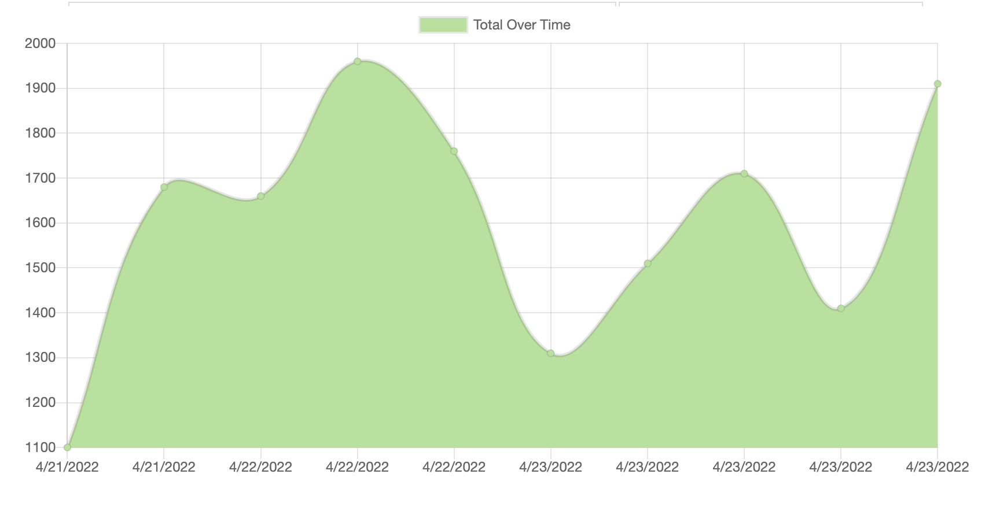

# The Pwafect Budget Tracker

https://pwafect-budget.herokuapp.com/

## Description

A mobile-friendly budget tracker for the casual spender on the go.  Your transactions will be saved even if you loose connectivity.  And use the PWA features, to download the Pwafect Budget Tracker as an app!

## Table of Contents

- [Installation](#installation)
- [Usage](#usage)
- [License](#license)
- [Questions](#questions)

## Installation

You can find the Pwafect Budget Tracker here: https://pwafect-budget.herokuapp.com/. You can also install the Pwafect Budget Tracker. On iOs, use Safari, tap the Share button, and tap "Add to Home Screen. On Android, use Chrome, tap the Menu, and tap "Add to Home Screen". On your computer, use Chrome, open the Settings, click "Install Images App", click Install when prompted, and a window will pop up with your new native desktop app.

## Usage

Simply add the name and cost of your transaction.  If you're adding funds, click add, and if your subtracting funds, click subtract. It's that simple!

## License

This application is licensed under ISC. Read more: (https://opensource.org/licenses/ISC).

## Questions?

For any further questions, you can find my github profile here: https://github.com/MrSumada
